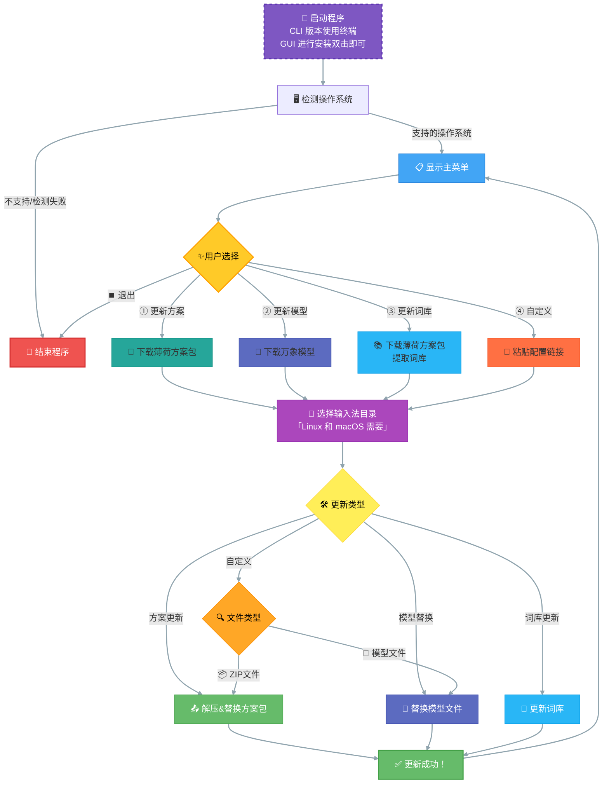

# oh-my-rime-cli

Rime 的 [Oh-my-rime](https://github.com/Mintimate/oh-my-rime) 配置自动更新与管理命令行工具，支持 Windows、Linux、macOS 多平台。


## 功能简介
- 一键下载和更新 Rime 主方案、模型、词库
- 自动检测操作系统，智能选择配置目录
- Windows 下支持注册表自动查找 Rime 用户目录
- 交互式美观菜单(支持命令行版本和 GUI界面)，支持多种输入法环境选择


```mermaid
flowchart TD
    A[🌟 启动程序 <br/> CLI 版本使用终端<br/>GUI 进行安装双击即可] --> B[🖥️ 检测操作系统]
    B --支持的操作系统--> C[📋 显示主菜单]
    B --不支持/检测失败--> I
    
    C --> D{"✨用户选择"}
    D -->|① 更新方案| E[💼 下载薄荷方案包]
    D -->|② 更新模型| F[🧠 下载万象模型]
    D -->|③ 更新词库| G[📚 下载薄荷方案包<br/>提取词库]
    D -->|④ 自定义| H[🔗 粘贴配置链接]
    D -->|⏹️ 退出| I[👋 结束程序]
    
    E --> J[📂 选择输入法目录<br/>「Linux 和 macOS 需要」]
    F --> J
    G --> J
    H --> J
    
    J --> K{🛠️ 更新类型}
    K -->|方案更新| L[📤 解压&替换方案包]
    K -->|模型替换| M[💾 替换模型文件]
    K -->|词库更新| N[🔄 更新词库]
    K -->|自定义| O{🔍 文件类型}
    
    O -->|📦 ZIP文件| L
    O -->|🧾 模型文件| M
    
    L --> P[✅ 更新成功！]
    M --> P
    N --> P
    
    P --> C

    style A fill:#7E57C2,stroke:#5E35B1,color:white,stroke-width:2px,stroke-dasharray:5
    style I fill:#EF5350,stroke:#D32F2F,color:white,stroke-width:2px
    style C fill:#42A5F5,stroke:#1976D2,color:white
    style D fill:#FFCA28,stroke:#FFA000,color:black,stroke-width:2px
    style E fill:#26A69A,stroke:#00897B
    style F fill:#5C6BC0,stroke:#3949AB
    style G fill:#29B6F6,stroke:#039BE5
    style H fill:#FF7043,stroke:#F4511E
    style J fill:#AB47BC,stroke:#8E24AA,color:white
    style K fill:#FFEE58,stroke:#FDD835,color:black
    style L fill:#66BB6A,stroke:#43A047,color:white
    style M fill:#5C6BC0,stroke:#3949AB,color:white
    style N fill:#29B6F6,stroke:#039BE5,color:white
    style O fill:#FFA726,stroke:#FB8C00,color:black
    style P fill:#66BB6A,stroke:#43A047,color:white,stroke-width:2px
    linkStyle default stroke:#90A4AE,stroke-width:2px
```

## 依赖说明
- Go 1.24 及以上
- Node.js 18+及npm (用于编译前端)
- Wails v2: `go install github.com/wailsapp/wails/v2/cmd/wails@latest`
- Windows 平台需支持 `golang.org/x/sys/windows/registry` 包

## 下载与安装

### 预编译版本下载

您可以在 [Releases](https://github.com/Mintimate/oh-my-rime-cli/releases) 页面下载预编译版本：

- **GUI 版本**：
  - macOS：下载 `.dmg` 文件
  - Windows：下载 `.exe` 安装包

- **CLI 版本**：
  - Windows：下载 `oh-my-rime-cli-windows.exe`
  - Linux：下载 `oh-my-rime-cli-linux`
  - macOS：下载 `/oh-my-rime-cli-darwin`

### 安全提示

⚠️ **重要提醒**：由于项目由开源社区维护，未购买并进行 Apple Developer / Windows 签名，可能被识别为未知来源程序。

**对于 macOS 用户 (Gatekeeper 绕过指南):**
打开 DMG 安装包或应用程序时可能会提示“已损坏，无法打开”或“无法验证开发者”。请使用以下两种方法之一绕过拦截：
1. **(推荐) 彻底清理隔离属性**：将应用拖入 `应用程序 (Applications)` 文件夹后，打开终端，执行以下命令即可一劳永逸：
   ```sh
   xattr -cr /Applications/Oh\ My\ Rime.app
   ```
2. **右键打开法**：将应用拖入 `应用程序` 文件夹后，**不要双击**，而是对着 `Oh My Rime.app` **右键 -> 打开**。在弹出的警告框中会多出一个“打开”按钮，点击即可。

**对于 Windows 用户:**
Windows Defender 可能会误报为病毒。请确保从官方 GitHub Releases 页面下载，并在杀毒软件中将其添加为信任/白名单。

## 使用方法

### 1. 编译 (Wails)

本项目 GUI 基于 Wails 开发，请确保已安装 Wails CLI。

#### Windows
在 Windows 下编译：
```sh
cd oh-my-rime-cli
wails build -upx
# 编译后的文件将生成在 build/bin/ 目录下
```

#### macOS/Linux
在 macOS 或 Linux 下编译：
```sh
cd oh-my-rime-cli
wails build
# macOS 将在 build/bin/ 下生成 .app 应用程序
```

#### 交叉编译 Windows 版本
在 macOS/Linux 下编译 Windows 可执行文件：
```sh
GOOS=windows GOARCH=amd64 go build -o oh-my-rime-cli.exe .
```

### 2. 运行

双击或命令行运行编译后的程序，根据提示选择操作和配置目录。

## 部分逻辑

### Windows 注册表支持
- Windows 下会自动读取注册表 `HKEY_CURRENT_USER\Software\Rime\Weasel` 的 `RimeUserDir` 字段
- 若注册表不存在或读取失败，自动回退到 `%APPDATA%\Rime` 目录


## 贡献与许可
- MIT License
- 欢迎提交 issue 和 PR

## 支持

- [Mintimate's Blog: https://www.mintimate.cn](https://www.mintimate.cn)
- [Mintimate的爱发电: 加入电圈，支持创造!](https://afdian.net/a/mintimate)
- [Bilibili：@Mintimate](https://space.bilibili.com/355567627)
- [Youtube：@Mintimate](https://www.youtube.com/channel/UCI7LLdUGNzkcKOE7grAqCoA)
