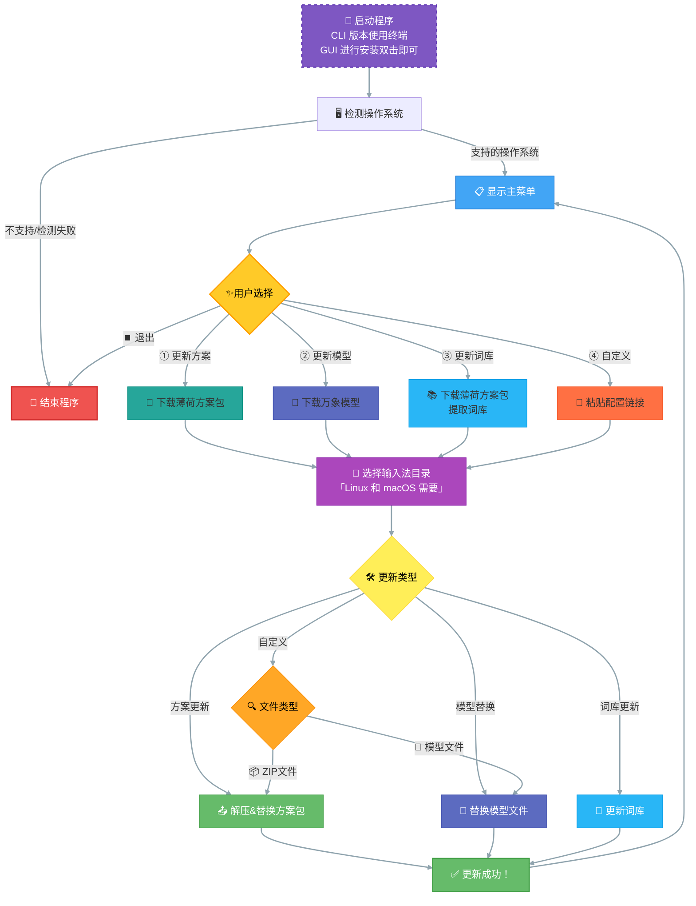

# oh-my-rime-cli

Rime 的 [Oh-my-rime](https://github.com/Mintimate/oh-my-rime) 配置自动更新与管理命令行工具，支持 Windows、Linux、macOS 多平台。


## 功能简介
- 一键下载和更新 Rime 主方案、模型、词库
- 自动检测操作系统，智能选择配置目录
- Windows 下支持注册表自动查找 Rime 用户目录
- 交互式美观菜单(支持命令行版本和 GUI界面)，支持多种输入法环境选择


```mermaid
flowchart TD
    A[🌟 启动程序 <br/> CLI 版本使用终端<br/>GUI 进行安装双击即可] --> B[🖥️ 检测操作系统]
    B --支持的操作系统--> C[📋 显示主菜单]
    B --不支持/检测失败--> I
    
    C --> D{"✨用户选择"}
    D -->|① 更新方案| E[💼 下载薄荷方案包]
    D -->|② 更新模型| F[🧠 下载万象模型]
    D -->|③ 更新词库| G[📚 下载薄荷方案包<br/>提取词库]
    D -->|④ 自定义| H[🔗 粘贴配置链接]
    D -->|⏹️ 退出| I[👋 结束程序]
    
    E --> J[📂 选择输入法目录<br/>「Linux 和 macOS 需要」]
    F --> J
    G --> J
    H --> J
    
    J --> K{🛠️ 更新类型}
    K -->|方案更新| L[📤 解压&替换方案包]
    K -->|模型替换| M[💾 替换模型文件]
    K -->|词库更新| N[🔄 更新词库]
    K -->|自定义| O{🔍 文件类型}
    
    O -->|📦 ZIP文件| L
    O -->|🧾 模型文件| M
    
    L --> P[✅ 更新成功！]
    M --> P
    N --> P
    
    P --> C

    style A fill:#7E57C2,stroke:#5E35B1,color:white,stroke-width:2px,stroke-dasharray:5
    style I fill:#EF5350,stroke:#D32F2F,color:white,stroke-width:2px
    style C fill:#42A5F5,stroke:#1976D2,color:white
    style D fill:#FFCA28,stroke:#FFA000,color:black,stroke-width:2px
    style E fill:#26A69A,stroke:#00897B
    style F fill:#5C6BC0,stroke:#3949AB
    style G fill:#29B6F6,stroke:#039BE5
    style H fill:#FF7043,stroke:#F4511E
    style J fill:#AB47BC,stroke:#8E24AA,color:white
    style K fill:#FFEE58,stroke:#FDD835,color:black
    style L fill:#66BB6A,stroke:#43A047,color:white
    style M fill:#5C6BC0,stroke:#3949AB,color:white
    style N fill:#29B6F6,stroke:#039BE5,color:white
    style O fill:#FFA726,stroke:#FB8C00,color:black
    style P fill:#66BB6A,stroke:#43A047,color:white,stroke-width:2px
    linkStyle default stroke:#90A4AE,stroke-width:2px
```

## 依赖说明

桌面端使用 Tauri 2 + React + TypeScript + Rust，GUI 和独立 CLI 共用 Rust 更新核心。

- Node.js 20+ 及 npm
- Rust stable、Cargo，以及 Tauri 2 对应的平台构建依赖
- macOS / Linux 需要系统 WebKit 构建依赖

## 下载与安装

### 预编译版本下载

您可以在 [Releases](https://github.com/Mintimate/oh-my-rime-cli/releases) 页面下载预编译版本：

- **GUI 版本**：
  - macOS：下载 `.dmg` 文件
  - Windows：下载 `.msi` 或 `.exe` 安装包
  - Linux：下载 `.deb`、`.rpm` 或 `.AppImage`

- **CLI 版本**：
  - Windows：`cli-windows-x64.exe`
  - Linux：`cli-linux-x64`
  - macOS：`cli-macos-arm64` 或 `cli-macos-x64`

### 安全提示

⚠️ **重要提醒**：由于项目由开源社区维护，未购买并进行 Apple Developer / Windows 签名，可能被识别为未知来源程序。

**对于 macOS 用户：**

发布包使用 ad-hoc 签名校验应用完整性，尚未使用 Developer ID 证书或通过 Apple 公证。首次打开从浏览器下载的应用时，仍可能提示“Apple 无法验证”或“无法验证开发者”。确认下载来源后：

1. 将 `Oh My Rime.app` 拖入“应用程序”文件夹，尝试打开一次，在提示中点击“完成”。
2. 打开 **系统设置 → 隐私与安全**，在“安全性”区域找到 Oh My Rime，点击 **仍要打开**，按系统提示确认。

这是首次运行的信任确认。若提示“已损坏”，应重新下载并检查签名，不要将它与未公证提示混为一谈。详见 [Apple 官方说明](https://support.apple.com/zh-cn/102445)。

**对于 Windows 用户:**
Windows Defender 可能会误报为病毒。请确保从官方 GitHub Releases 页面下载，并在杀毒软件中将其添加为信任/白名单。

## 使用方法

### 1. 编译（Tauri 2）

新桌面端位于 `src/` 与 `src-tauri/`，下载、备份、解压和平台路径等核心逻辑位于 `src-tauri/src/rime_core.rs`，GUI 与 Rust CLI 共用同一套更新核心。

```sh
npm install
npm run dev        # 开发模式
npm run build      # 构建桌面应用
npm run build:web  # 只构建前端
cargo test --manifest-path src-tauri/Cargo.toml
```

macOS 下如果只需要验证应用 Bundle，可以运行：

```sh
npx tauri build --bundles app
```

DMG、Windows 安装包和 Linux 安装包需要在对应平台的 CI 或本机完整构建环境中生成。

### 2. 运行

双击 Tauri 构建产物启动 GUI，选择 Rime 目标目录后执行更新。也可以运行新的共享核心 CLI：

```sh
cargo run --manifest-path src-tauri/Cargo.toml --features cli --bin oh-my-rime-cli
```

更新会先下载到临时文件并创建备份；失败时会尝试恢复更新前的目录。更新成功后，请使用对应输入法的“重新部署”功能使更改生效。

## 部分逻辑

### 平台目录检测

- Windows 优先读取 `HKEY_CURRENT_USER\Software\Rime\Weasel` 的 `RimeUserDir`
- Windows 注册表读取失败时回退到 `%APPDATA%\Rime`
- macOS 支持鼠须管和 Fcitx5
- Linux 支持 iBus、Fcitx5 和 Fcitx5 Flatpak

## 贡献与许可
- MIT License
- 欢迎提交 issue 和 PR

## 支持

- [Mintimate's Blog: https://www.mintimate.cn](https://www.mintimate.cn)
- [Mintimate的爱发电: 加入电圈，支持创造!](https://afdian.net/a/mintimate)
- [Bilibili：@Mintimate](https://space.bilibili.com/355567627)
- [Youtube：@Mintimate](https://www.youtube.com/channel/UCI7LLdUGNzkcKOE7grAqCoA)
