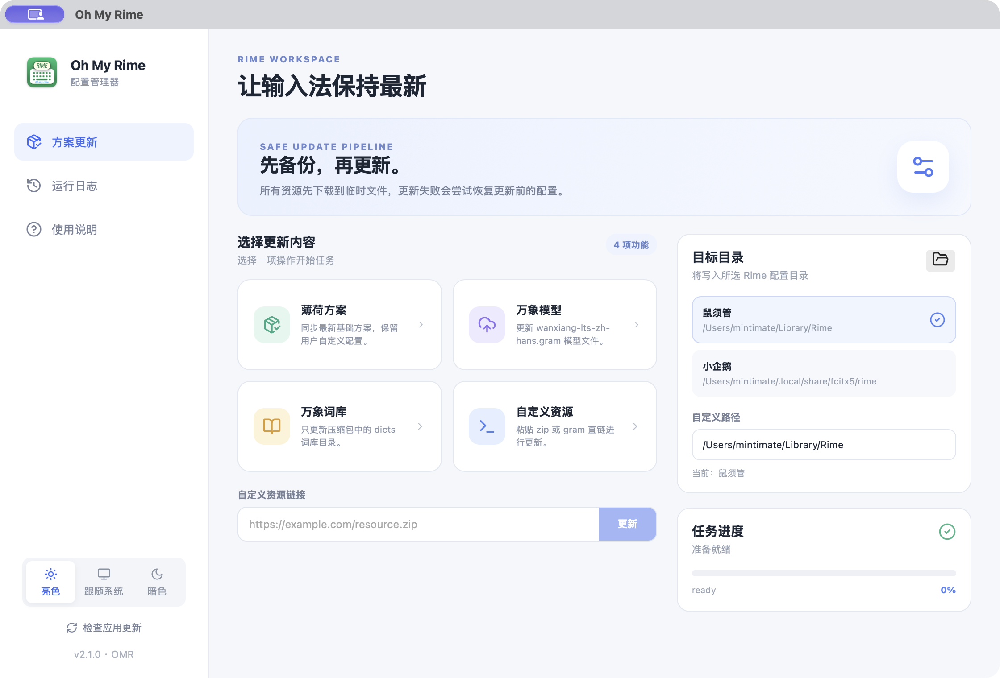
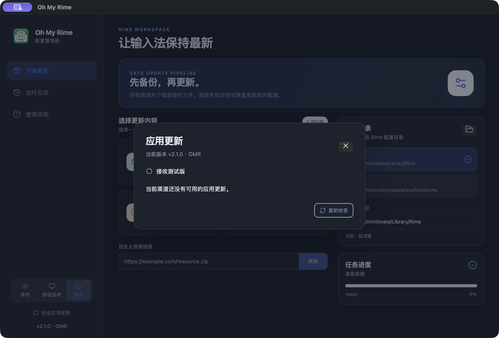

# Oh My Rime · OMR

[English](README_en.md) · [桌面端使用与发布说明](GUI_README.md) · [GitHub 下载](https://github.com/Mintimate/oh-my-rime-cli/releases) · [CNB 镜像下载](https://cnb.cool/Mintimate/rime/oh-my-rime-cli/-/releases)

用于更新和维护 [薄荷输入法 Oh-my-rime](https://github.com/Mintimate/oh-my-rime) 配置的桌面工具与独立 CLI，支持 macOS、Windows 和 Linux。

> v4.0.0 起使用 Tauri 2 + React + TypeScript + Rust。旧 Go/Wails 版本需手动安装一次新版，之后可使用应用自动更新。

## 界面演示

以下为 macOS 原始分辨率实机截图（2240 × 1520，无损 PNG）。主界面支持亮色、跟随系统和暗色模式，截图随文档页面主题切换。

<picture>
  <source media="(prefers-color-scheme: dark)" srcset="assets/img/usingAppDark.png">
  <source media="(prefers-color-scheme: light)" srcset="assets/img/usingApp.png">
  
</picture>

[查看亮色界面](assets/img/usingApp.png) · [查看暗色界面](assets/img/usingAppDark.png)

## 功能

- 更新薄荷方案、万象模型和万象词库，也支持自定义 `.zip`、`.gram` 资源链接。
- 自动检测平台并提供 Rime 目录预设，支持手动选择目录。
- 下载到临时目录后再备份和更新，失败时尝试恢复；主方案更新保留 `*.custom.yaml`。
- 显示任务进度和本次会话日志，支持复制日志。
- 亮色 / 跟随系统 / 暗色三段式切换，保存外观偏好。
- 自动检查应用新版本，查看更新说明，下载、验签、安装并重启；可选择接收测试版。
- GUI 与独立 CLI 共用 Rust 更新核心；不上传用户配置，不包含遥测。

## 下载与安装

在 [Releases](https://github.com/Mintimate/oh-my-rime-cli/releases) 中选择对应平台和架构。下面是 Rust 版产物命名；测试版本标记为 **Pre-release**。

| 平台 | 桌面安装包 | 独立 CLI |
| --- | --- | --- |
| macOS Apple Silicon | `Oh-My-Rime_<版本>_macOS_arm64.dmg` | `cli-macos-arm64` |
| macOS Intel | `Oh-My-Rime_<版本>_macOS_x64.dmg` | `cli-macos-x64` |
| Windows x64 | `.msi` 或 `-setup.exe` | `cli-windows-x64.exe` |
| Linux x64 | `.AppImage`、`.deb` 或 `.rpm` | `cli-linux-x64` |

`.app.tar.gz`、`.sig` 和 `latest.json` 供应用自动更新使用；macOS 手动安装请选择 DMG。

### macOS 首次打开

安装包采用 ad-hoc 签名，尚未使用 Developer ID 证书或通过 Apple 公证。

1. 将 `Oh My Rime.app` 拖入“应用程序”文件夹，再尝试打开。
2. 如提示无法验证开发者，确认下载来源后，在 **系统设置 → 隐私与安全 → 仍要打开** 中确认，按系统提示输入 Mac 登录密码或使用触控 ID。

具体提示取决于 macOS 版本和安全策略。若提示“已损坏”，请重新下载并检查签名。参见 [Apple 官方说明](https://support.apple.com/zh-cn/102445) 和 [签名检查命令](GUI_README.md#构建)。

Windows 安装包目前未配置代码签名，请从本项目 Releases 下载并核对来源后再运行。

## 更新 Rime 配置

1. 在“方案更新”页选择或填写 Rime 配置目录。
2. 选择薄荷方案、万象模型或万象词库；自定义资源需先填写下载链接。
3. 查看任务进度，必要时打开“运行日志”查看详细信息。
4. 更新成功后，使用对应输入法的“重新部署”功能使更改生效。

平台目录预设：

- Windows：优先读取 `HKEY_CURRENT_USER\Software\Rime\Weasel` 的 `RimeUserDir`，失败后回退到 `%APPDATA%\Rime`。
- macOS：鼠须管、小企鹅 Fcitx5。
- Linux：iBus、Fcitx5、Fcitx5 Flatpak。

## 更新 OMR 应用

应用启动后自动检查新版本，也可点击左下角 **检查应用更新**。发现新版本后，查看更新说明，点击 **下载并安装**；应用验证签名后安装并重新启动。Rime 配置更新进行中不能安装应用更新。



截图展示尚无可用更新的状态，未模拟新版本或下载进度。

- 正式版默认仅接收正式版；测试版首次运行默认接收测试版，可通过 **接收测试版** 切换，设置会保留。
- 只识别带更新清单的发布，旧 Go 版不会作为 Rust 桌面端更新。
- 网络错误不影响其他功能，可稍后重新检查。
- 没有自动更新功能的旧版本需要先手动安装一次新版；独立 CLI 仍需手动更新。
- macOS 请从“应用程序”运行，不要在只读 DMG 中安装更新。

## 本地开发

需要 Node.js 20.19+（或 22.12+）、Rust stable，以及 Tauri 2 对应的系统构建依赖。桌面端源码位于 `src/`，共享更新核心位于 `src-tauri/src/rime_core.rs`。

```bash
npm ci
npm run dev
```

无需更新私钥的本地构建：

```bash
npm run build -- --config '{"bundle":{"createUpdaterArtifacts":false}}'
```

运行独立 CLI：

```bash
cargo run --manifest-path src-tauri/Cargo.toml --features cli --bin oh-my-rime-cli
```

检查与测试：

```bash
npm run typecheck
npm run build:web
npm run test:release
cargo fmt --manifest-path src-tauri/Cargo.toml -- --check
cargo test --manifest-path src-tauri/Cargo.toml --features cli
```

## 发布版本

使用 `npm run bump <版本>` 同步 npm、Tauri 和 Cargo 的版本，提交后推送匹配的 `v<版本>` 标签。例如，下一个测试版可使用 `4.0.1-test.1` 与 `v4.0.1-test.1`。不要只改 Git 标签而保持应用版本不变。

GitHub Actions 会构建安装包和 CLI，签署更新产物，生成 `latest.json`，验证全部更新包后才公开 Release。仓库需配置 `TAURI_SIGNING_PRIVATE_KEY` Secret；加密私钥还需配置对应密码。私钥不得提交到仓库，后续版本须继续使用同一套签名密钥。

GitHub 发布成功后会自动同步标签到 CNB，由 `.cnb.yml` 拉取同一批安装包、CLI 和签名并创建 CNB Release。应用内更新目前使用 GitHub；CNB 提供镜像下载。

完整流程见 [发布签名更新](GUI_README.md#发布签名更新)。

## 贡献与许可

使用 MIT License，欢迎提交 Issue 和 PR。

## 支持

- [Mintimate's Blog](https://www.mintimate.cn)
- [爱发电：支持创造](https://afdian.net/a/mintimate)
- [Bilibili：@Mintimate](https://space.bilibili.com/355567627)
- [YouTube：@Mintimate](https://www.youtube.com/channel/UCI7LLdUGNzkcKOE7grAqCoA)
