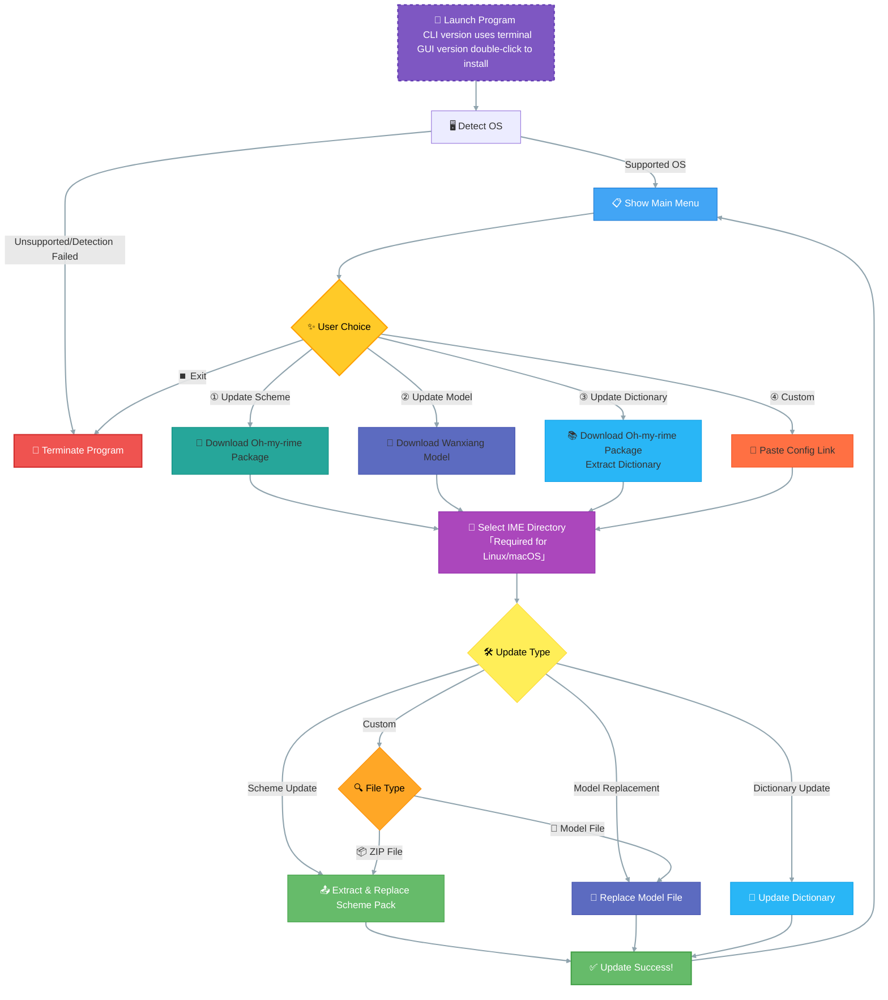

# oh-my-rime-cli

A command-line tool for automatic update and management of Rime [Oh-my-rime](https://github.com/Mintimate/oh-my-rime) configuration, supporting Windows, Linux, and macOS.


## Features
- One-click download and update of Rime main scheme, model, and dictionaries
- Auto-detect operating system and select configuration directory intelligently
- Windows: automatically locate Rime user directory via registry
- Interactive and user-friendly menu (supports both CLI version and GUI interface), supports multiple input method environments


```mermaid
flowchart TD
    A[🌟 Launch Program <br/> CLI version uses terminal<br/>GUI version double-click to install] --> B[🖥️ Detect OS]
    B --Supported OS--> C[📋 Show Main Menu]
    B --Unsupported/Detection Failed--> I
    
    C --> D{"✨ User Choice"}
    D -->|① Update Scheme| E[💼 Download Oh-my-rime Package]
    D -->|② Update Model| F[🧠 Download Wanxiang Model]
    D -->|③ Update Dictionary| G[📚 Download Oh-my-rime Package<br/>Extract Dictionary]
    D -->|④ Custom| H[🔗 Paste Config Link]
    D -->|⏹️ Exit| I[👋 Terminate Program]
    
    E --> J[📂 Select IME Directory<br/>「Required for Linux/macOS」]
    F --> J
    G --> J
    H --> J
    
    J --> K{🛠️ Update Type}
    K -->|Scheme Update| L[📤 Extract & Replace Scheme Pack]
    K -->|Model Replacement| M[💾 Replace Model File]
    K -->|Dictionary Update| N[🔄 Update Dictionary]
    K -->|Custom| O{🔍 File Type}
    
    O -->|📦 ZIP File| L
    O -->|🧾 Model File| M
    
    L --> P[✅ Update Success!]
    M --> P
    N --> P
    
    P --> C

    style A fill:#7E57C2,stroke:#5E35B1,color:white,stroke-width:2px,stroke-dasharray:5
    style I fill:#EF5350,stroke:#D32F2F,color:white,stroke-width:2px
    style C fill:#42A5F5,stroke:#1976D2,color:white
    style D fill:#FFCA28,stroke:#FFA000,color:black,stroke-width:2px
    style E fill:#26A69A,stroke:#00897B
    style F fill:#5C6BC0,stroke:#3949AB
    style G fill:#29B6F6,stroke:#039BE5
    style H fill:#FF7043,stroke:#F4511E
    style J fill:#AB47BC,stroke:#8E24AA,color:white
    style K fill:#FFEE58,stroke:#FDD835,color:black
    style L fill:#66BB6A,stroke:#43A047,color:white
    style M fill:#5C6BC0,stroke:#3949AB,color:white
    style N fill:#29B6F6,stroke:#039BE5,color:white
    style O fill:#FFA726,stroke:#FB8C00,color:black
    style P fill:#66BB6A,stroke:#43A047,color:white,stroke-width:2px
    linkStyle default stroke:#90A4AE,stroke-width:2px
```

## Dependencies
- Go 1.24 or above
- Node.js 18+ and npm (for frontend building)
- Wails v2: `go install github.com/wailsapp/wails/v2/cmd/wails@latest`
- On Windows, requires `golang.org/x/sys/windows/registry` package

## Download & Installation

### Pre-compiled Version Download

You can download pre-compiled versions from the [Releases](https://github.com/Mintimate/oh-my-rime-cli/releases) page:

- **GUI Version**:
  - macOS: Download `.dmg` file
  - Windows: Download `.exe` installer

- **CLI Version**:
  - Windows: Download `oh-my-rime-cli-windows.exe`
  - Linux: Download `oh-my-rime-cli-linux`
  - macOS: Download `oh-my-rime-cli-darwin`

### Security Notice

⚠️ **Important Reminder**: Since the project is an open-source tool without paid Apple Developer / Windows certificates, it might be falsely reported as untrusted software.

**For macOS Users (Gatekeeper Bypass):**
When opening the downloaded DMG or the `.app`, you might see a "damaged app" or "unidentified developer" warning. Please use one of the following methods to bypass:
1. **(Recommended) Clear quarantine attribute**: Drag the app to your `Applications` folder, then open your Terminal and run the following command:
   ```sh
   xattr -cr /Applications/Oh\ My\ Rime.app
   ```
2. **Right-Click Method**: Drag the app to your `Applications` folder. **Do not double-click it**. Instead, **Right-Click -> Open**. The warning dialog will now have an "Open" button.

**For Windows Users:**
Windows Defender might falsely report it as a virus. Please ensure you download from the official GitHub Releases page and add it to your antivirus whitelist.

## Usage

### 1. Build (Wails)

This project GUI is built with Wails. Ensure you have Wails CLI installed.

#### Windows
Build on Windows:
```sh
cd oh-my-rime-cli
wails build -upx
# The compiled file will be generated in the build/bin/ directory
```

#### macOS/Linux
Build on macOS or Linux:
```sh
cd oh-my-rime-cli
wails build
# macOS will generate a .app application inside build/bin/
```

#### Cross-compile for Windows
Build Windows executable on macOS/Linux:
```sh
GOOS=windows GOARCH=amd64 go build -o oh-my-rime-cli.exe .
```

### 2. Run

Double-click or run the compiled program in the command line, and follow the prompts to select actions and configuration directory.

## Partial Logic

### Windows Registry Support
- On Windows, automatically reads the `RimeUserDir` value from `HKEY_CURRENT_USER\Software\Rime\Weasel` registry
- If the registry key does not exist or fails to read, automatically falls back to `%APPDATA%\Rime` directory


## Contribution & License
- MIT License
- Issues and PRs are welcome

## Support

- [Mintimate's Blog: https://www.mintimate.cn](https://www.mintimate.cn)
- [Mintimate的爱发电: 加入电圈，支持创造!](https://afdian.net/a/mintimate)
- [Bilibili：@Mintimate](https://space.bilibili.com/355567627)
- [Youtube：@Mintimate](https://www.youtube.com/channel/UCI7LLdUGNzkcKOE7grAqCoA)
