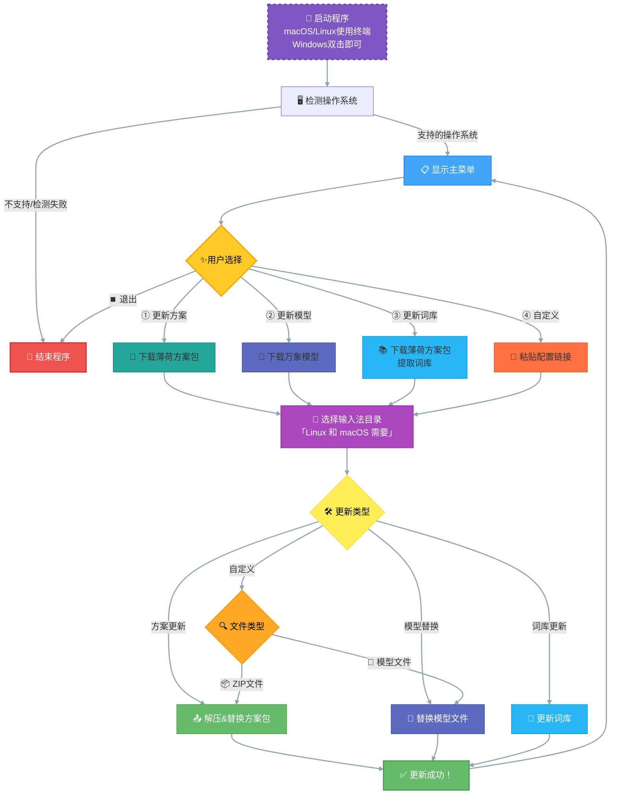

# oh-my-rime-cli

Rime 的 [Oh-my-rime](https://github.com/Mintimate/oh-my-rime) 配置自动更新与管理命令行工具，支持 Windows、Linux、macOS 多平台。

## 功能简介
- 一键下载和更新 Rime 主方案、模型、词库
- 自动检测操作系统，智能选择配置目录
- Windows 下支持注册表自动查找 Rime 用户目录
- 交互式美观菜单(就是命令行~)，支持多种输入法环境选择



## 依赖说明
- Go 1.24 及以上
- Windows 平台需支持 `golang.org/x/sys/windows/registry` 包

## 使用方法

### 1. 编译

#### Windows
在 Windows 下直接编译：
```sh
# 推荐在 Windows 命令行下执行
cd oh-my-rime-cli
go build -o oh-my-rime-cli.exe .
```

#### macOS/Linux
在 macOS 或 Linux 下编译：
```sh
cd oh-my-rime-cli
go build -o oh-my-rime-cli .
```

#### 交叉编译 Windows 版本
在 macOS/Linux 下编译 Windows 可执行文件：
```sh
GOOS=windows GOARCH=amd64 go build -o oh-my-rime-cli.exe .
```

### 2. 运行

双击或命令行运行编译后的程序，根据提示选择操作和配置目录。

##部分逻辑

Windows 注册表支持
- Windows 下会自动读取注册表 `HKEY_CURRENT_USER\Software\Rime\Weasel` 的 `RimeUserDir` 字段。
- 若注册表不存在或读取失败，自动回退到 `%APPDATA%\Rime` 目录。


## Windows 报毒问题

由于 Windows Defender 和其他杀毒软件可能会误报 Go 编译的可执行文件为病毒，请确保从本官方渠道下载或自行编译，并在必要时添加信任。

> 我并没有购买代码签名证书，因此无法提供签名的可执行文 \(o′ω`o)ノ


## 贡献与许可
- MIT License
- 欢迎提交 issue 和 PR

## 支持

- [Mintimate's Blog: https://www.mintimate.cn](https://www.mintimate.cn)
- [Mintimate的爱发电: 加入电圈，支持创造!](https://afdian.net/a/mintimate)
- [Bilibili：@Mintimate](https://space.bilibili.com/355567627)
- [Youtube：@Mintimate](https://www.youtube.com/channel/UCI7LLdUGNzkcKOE7grAqCoA)
